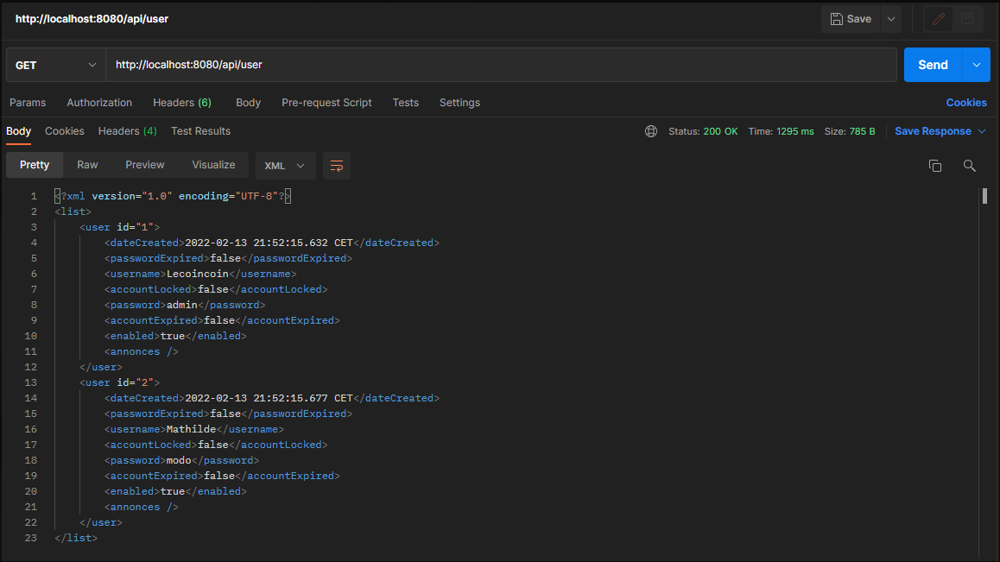
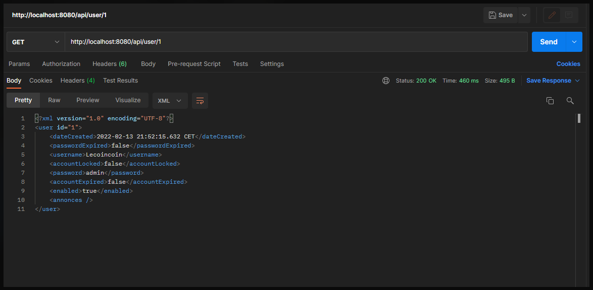

# Groupe 3
## Membres
- N:5 HERIHARSON Tamby Mampionona
- N:12 RAHARIFETRA Holy Nicole
- N:26 RAZAFINDRAZAKA Andry

## Lecoincoin 
### Objetifs


### Déscription du projet
```
Le projet de numérisation de dépôt de vente Lecoincoin est composé de 2 parties bien distinct :
    - Frontend 
    - Backend
```
#### Fronted :
Une interface qui permettra aux clients de pouvoir voir les différentes annonces disponibles
#### Backend :
- Utilisateur : pour permettre l’accès sécurisé aux différentes opérations de la partie administrateur, chaque utilisateur ayant rôle bien spécifique
    - Admin ou modérateur : les seuls qui peuvent avoir accès au backend
    - Client : pour les simples personnes voulant voir les annonces
- Annonce : pour permettre la création, la modification, ou la suppression des différentes annonces qui seront affichés sur le frontend

- API: de type REST pouvant être appelé pour pouvoir :
    
    - Récupérer un ou plusieurs utilisateur ou annonce
    - Créer un utilisateur ou annonce
    - Modifier un utilisateur ou annonce
    - Supprimer un utilisateur ou annonce
-  vous trouverez le projet [ici](lien)

### API REST

#### Actions disponible

##### Récuperation liste des utilisateurs

``` 
GET 
    url: http://localhost:8080/api/user 
```



##### Récuperation d'un utilisateur

``` 
GET 
    url: http://localhost:8080/api/user/1
```



##### Récuperation d'un utilisateur

``` 
GET 
    url: http://localhost:8080/api/user/1
```


##### Création d'un utilisateur

``` 
POST 
    url: http://localhost:8080/api/user
```


##### Modification d'un utilisateur

``` 
PUT 
    url: http://localhost:8080/api/user
```


##### Suppression de l’utilisateur

``` 
DELETE 
    url: http://localhost:8080/api/user
```

#### ANNONCE

##### Récupèration liste des annonces

``` 
GET 
    url: http://localhost:8080/api/annonce
```


##### Récupèration liste des annonces

``` 
GET 
    url: http://localhost:8080/api/annonce
```

##### Récupèration d'une annonce via son id

``` 
GET 
    url: http://localhost:8080/api/annonce/1
```

##### Création d'une annonce

``` 
POST 
    url: http://localhost:8080/api/annonce
```

##### Modification d'une annonce

``` 
PUT 
    url: http://localhost:8080/api/annonce/1
```

##### Suppression d'une annonce

``` 
DELETE 
    url: http://localhost:8080/api/annonce/1
```